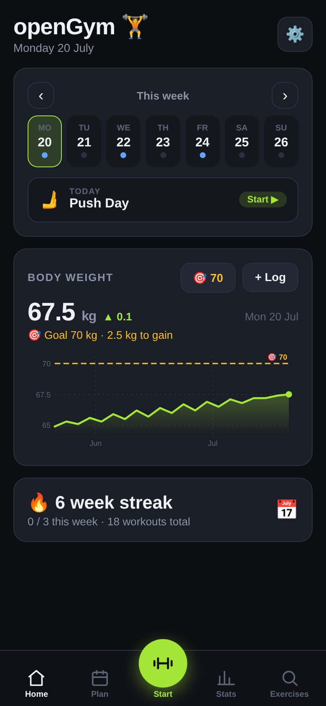
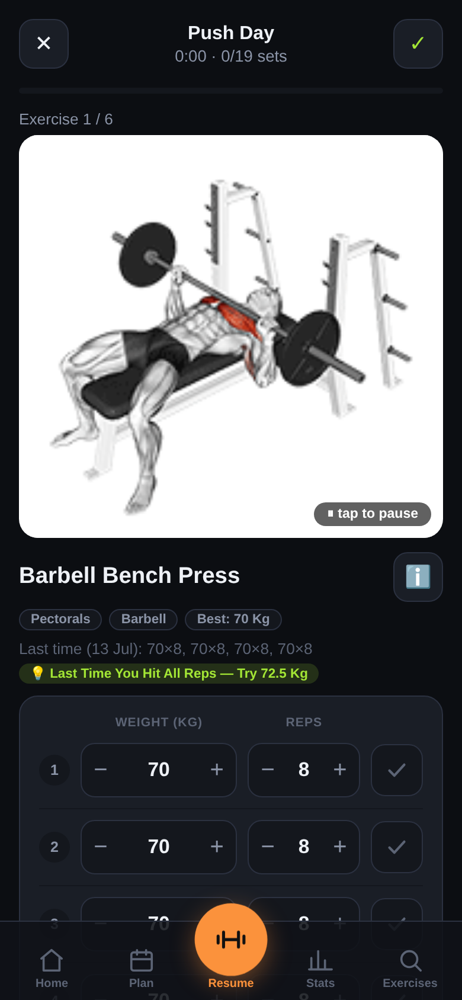
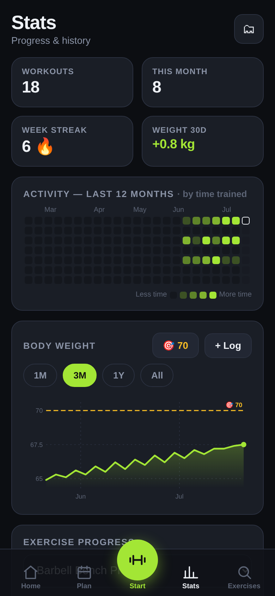

<div align="center">


<br>

**A self-hosted gym & body-weight tracker you actually own.**

Plan your week, run guided workouts, track every set and your body weight over time —
on your phone, synced across devices, behind your own passkey login.
No account on someone else's server, no subscription, no ads. Just `docker compose up`.

<br>

[](LICENSE)


<br>

[](https://github.com/DuarteSantos8/openGym/stargazers)
[](https://github.com/DuarteSantos8/openGym/issues)

</div>

<br>

<div align="center">
<table>
<tr>
<td align="center"><br><sub><b>Home</b> — today's workout & weight</sub></td>
<td align="center"><br><sub><b>Guided workout</b> — animated demos & sets</sub></td>
<td align="center"><br><sub><b>Stats</b> — heatmap, charts & PRs</sub></td>
</tr>
</table>
</div>

## Why

Most workout apps lock your data behind a login on their servers, nag you to upgrade, or
disappear when the startup does. openGym is the opposite: **it runs on your box, your data
stays in a folder you control, and it's yours to fork.** It still feels modern — installable
as a home-screen app, passkey sign-in, offline support, sync across your phone and laptop.

## Features

- ⚖️ **Body-weight tracking** — interactive chart with a goal line you set, gains/losses colored by whether they move toward it
- 🏋️ **Weekly plan** — a routine per weekday, over a library of **1,324 exercises** (searchable, with animated demos)
- 🗓️ **Reschedule any day** — sick, missed a session, or fewer gym days this week? Move a workout to another day without touching your weekly plan
- ▶️ **Guided workouts** — it knows what day it is and starts today's session; asks your body weight first, pre-fills your weights from last time, rest timer, PR detection, per-exercise weight tracking
- 🔗 **Supersets** — build them, and log them back-to-back with a rest only after the pair
- 🏃 **Cardio** — log time + speed, not just weight × reps
- 🟩 **Activity heatmap** — a GitHub-style year view, shaded by time spent training
- 🔑 **Passkeys, not passwords** — Face ID / Touch ID / fingerprint login; each profile keeps its own data, synced across devices
- 🎨 **Themes** — light/dark + 8 accent colors, saved to your profile
- 📦 **Yours to keep** — one-tap JSON export/import, guest mode, **no telemetry**

## Quick start (self-host)

You need [Docker](https://docs.docker.com/get-docker/) with Compose.

```bash
git clone https://github.com/DuarteSantos8/openGym
cd openGym
cp .env.example .env
docker compose up -d
```

Open **http://localhost:8080**, tap **Create profile**, and you're in. First launch downloads
the exercise media (~140 MB) once and builds the app inside Docker — you don't need Node or a
build step locally.

> Want it reachable from your phone over the internet with passkeys? You'll need an HTTPS
> domain — a two-line change in `.env`. See **[docs/SELF_HOSTING.md](docs/SELF_HOSTING.md)**.

## How it works

```
┌─────────────┐        ┌──────────────────────────────┐
│  Your phone │──HTTPS─▶│  web  (nginx)                │
│  / laptop   │        │   ├─ serves the built app    │
└─────────────┘        │   └─ proxies /api ──────────┐│
                       └──────────────────────────────┘│
                                                        ▼
                                        ┌──────────────────────────┐
                                        │  api  (Node + WebAuthn)  │
                                        │   └─ ./data (JSON files) │
                                        └──────────────────────────┘
```

- **frontend/** — React + Vite (React Router + Zustand), built to static files **inside Docker**
- **api/** — Node with no framework, one dependency (`@simplewebauthn/server`), storing everything as plain JSON files under `./data`
- **web/** — a multi-stage image that builds the frontend and serves it with nginx, proxying `/api` to the backend so it's all on **one origin** (passkeys require this)

## Your data

Lives in `./data` on your host: `db.json` (profiles + public passkeys), `state-<user>.json`
(each user's plan, workouts, body weight, settings), and `secret` (the session-cookie key).
**Back up `./data` and you've backed up everything.** Passkey private keys never touch the
server — they stay in your phone's secure hardware / your password manager.

## Configuration

All via `.env` (see `.env.example`):

| Variable   | What it is                        | Default                 |
|------------|-----------------------------------|-------------------------|
| `RP_ID`    | Hostname passkeys are bound to    | `localhost`             |
| `ORIGIN`   | Full URL the app is served from   | `http://localhost:8080` |
| `WEB_PORT` | Host port for the web UI          | `8080`                  |
| `RP_NAME`  | Name shown in the passkey prompt  | `openGym`               |

## Roadmap

Rough, community-driven — ideas and PRs welcome:

- [ ] More starter plans (upper/lower, full-body, 5×5)
- [ ] Importers from Strong / Hevy (CSV → openGym JSON)
- [ ] Body measurements (waist, arms…) alongside weight
- [ ] Per-exercise notes & plate calculator
- [ ] More exercise-instruction languages (the dataset ships several)

## Tech

React 19 + Vite (React Router, Zustand) · Node (no framework) · nginx · Docker Compose ·
WebAuthn · exercise data from [hasaneyldrm/exercises-dataset](https://github.com/hasaneyldrm/exercises-dataset).
No database server, no cloud dependencies — the frontend builds inside Docker, so self-hosting
stays a one-command `docker compose up`.

## Contributing

Issues and PRs welcome — see [CONTRIBUTING.md](CONTRIBUTING.md). Good first issues: more starter
plans, exercise-data languages, import from other trackers. **A ⭐ helps more people find it.**

## License

[GNU AGPL v3.0](LICENSE) — free and open source. You can self-host, use, modify and share it;
if you run a modified version as a network service, you must offer that version's source under
the same license. Nobody can turn openGym into a closed, proprietary product.

Exercise images/GIFs are fetched from the upstream dataset and keep their own terms — see [NOTICE.md](NOTICE.md).
